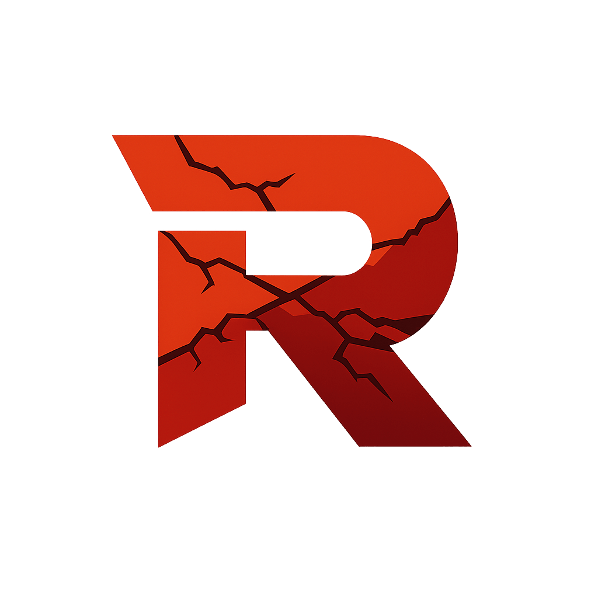

# Rubigo

  

📄 [Whitepaper](whitepaper.md) • ⚖️ [License](LICENSE) • ⚖️ [Additional License](LICENSE-ADDITIONAL.md) • 🌐 [Website](https://rubigo.qzz.io/) 

Privacy-first, decentralized cryptocurrency built in Rust and Assembly! Mine with any device, from esp32 to servers. No KYC, no compromise.

## ⚠️ Core Principles — Non-Negotiable

Rubigo is built on one fundamental rule:

**NO KYC. EVER.**

Any implementation, fork, pool, exchange, or service built on Rubigo is strictly prohibited from:
- Collecting personal information of any kind
- Requiring identity verification
- Logging IP addresses
- Storing transaction metadata linked to identities
- Complying with any request to deanonymize users

Violating these principles is a direct breach of the AGPL-3.0 license and goes against the core values of this project.

> "Financial privacy is not a privilege. It's a right."

====================
UID : 3D CA 95 81 
Type : MIFARE 1KB
